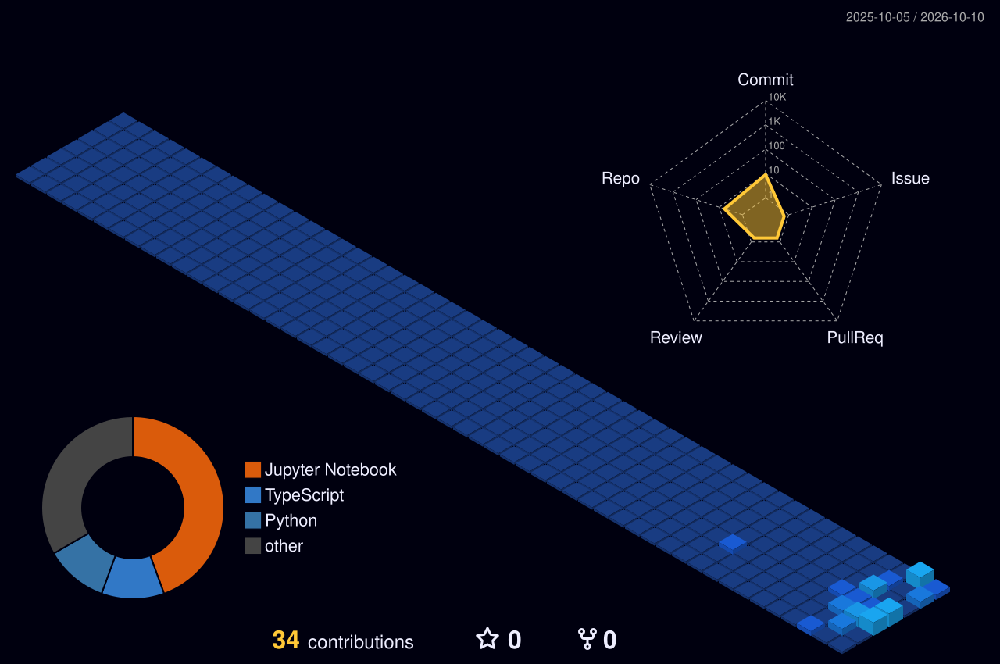

<picture><source media="(prefers-color-scheme: dark)" srcset="https://coolreadme.xyz/api/hero-banner?user=luisreyna060318-alt&title=luisreyna060318-alt&subtitle=Building%20things%20on%20the%20internet&theme=dark"></picture>

<picture><source media="(prefers-color-scheme: dark)" srcset="https://coolreadme.xyz/api/typing-card?user=luisreyna060318-alt&lines=Building%20things%20on%20the%20internet%7Cgithub.com%2Fluisreyna060318-alt&theme=dark"></picture>

### Featured projects

<picture><source media="(prefers-color-scheme: dark)" srcset="https://coolreadme.xyz/api/projects-gallery?user=luisreyna060318-alt&repos=My_Game%2CSimple-Hand-Tracking&copy=%7B%22My_Game%22%3A%22%22%2C%22Simple-Hand-Tracking%22%3A%22%22%7D&layout=spotlight&theme=dark"></picture>

### Stats

### Currently

### Workflow

### Stack

### Stats

### More

Built with [coolreadme.xyz](https://coolreadme.xyz/u/luisreyna060318-alt) — one-click GitHub README cards.
